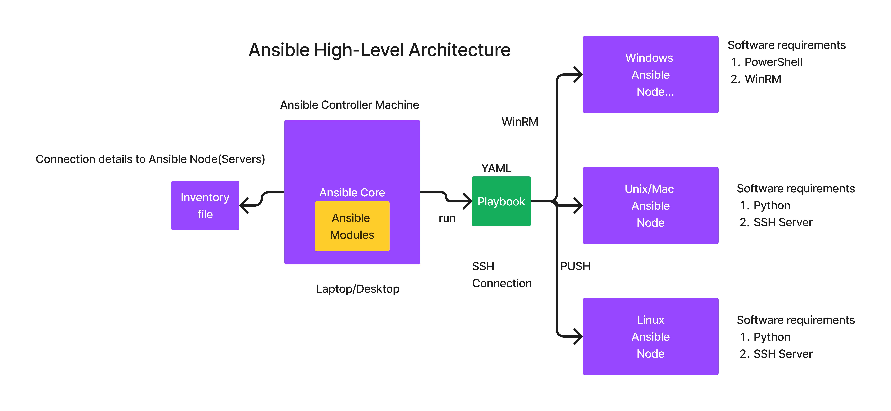

# Day 2

## Lab - Write a python program that reads a text file and print the occurence of each word in the file

Note
<pre>
- the word can be treated case insensitive
- i.e Apple, apple, APPLE, APple can be treated as same
</pre>

## Info - API Overview
<pre>
- API - Application Programming Interface
- let's two or more applications interact with each other via APIs
- allows applications to exchange data
- useful in authentWorking With Files

	Reading And Writing Files

	Parsing Different File Formats (CSV, JSON, YAML)icating applications
- helps in integrating 3rd party applications and their services
- examples
  - Google Map API
  - PayTM or GPay APIs
  - Gmail, Facebook Integration or Authentication
- REST API Methods
  - GET  - used while retrieving data ( retrieved already registered user details )
  - POST - used while creating new records ( registering new users )
  - PUT  - used while updating existing data
  - PATCH - used while updating partial update
  - DELETE - deleting a record
</pre>


## Lab - Running and testing the REST API
Open Terminal Tab 1, run the below command
```
cd ~/ansible-nov-2025
git pull
cd Day2/python/REST-API
uvicorn main:app --reload
```

Open Terminal Tab, run the below command
```
# To try retrieving existing records
curl -X GET http://localhost:8000/employees
curl -X GET http://localhost:8000/employees/1
curl -X GET http://localhost:8000/employees/2

# To add new record
curl -X POST http://localhost:8000/employees \
-H "Content-Type": "application/json" \
-d '{"id": 100, "name": "Siddharth", "dept": "IT"}'

# To try updating existing record
curl -X PUT http://localhost:8000/employees \
-H "Content-Type": "application/json" \
-d '{"id": 100, "name": "Shankar", "dept": "IT"}'

# To delete existing record
curl -X DELETE http://localhost:8000/employees/2 \
-H "Content-Type": "application/json"
```

## Info - Provisioning Tool
<pre>
- using provisioning tools one can automate the infrastructure
- i.e create a virtual machine on the local data center, or public cloud (AWS, Azure, GCP )
- examples
  - AWS Cloudformation
  - Terraform
</pre>
	
## Info - Configuration Management Tool
<pre>
- Configuration Management Tools helps us in automating system administrative tasks
- configuration is done on a machine with pre-installed OS
- on a machine where OS is already installed, you can use configuration management tools to further install softwares, configure the software, perform user management, etc.,
- examples
  - Puppet
  - Chef
  - Salt/Saltstack ( This is almost dead )
  - Ansible
</pre>

## Info - Ansible Overview
<pre>
- is developed in Python by Michael Deehan
- Michael was former employee(architect) of Red Hat
- He left Red Hat and he started a company called Ansible Inc
- He developed Ansible Core as an open source project
- comes in 3 flavours
  1. Ansible Core 
  2. AWX
  3. Ansible Automation Platform ( earlier was called Ansible Tower )
</pre>

## Info - Ansible Core
<pre>
- an opensource project
- supports command-line only
- can manage Windows, Unix, Linux and Mac Ansible Nodes
- the machine where the automation is done is called Ansible Node
- the machine where Ansible is installed is called Ansible Controller Machine(ACM)
- Ansible can be installed on Linux machines ( unofficially works in Mac OS-X )
- Ansible can't be natively installed on Windows
- ACM machine can't be a Windows machine, however ansible can manage a Windows server
</pre>

## Info - AWX
<pre>
- is an opensource project
- developed on top of Ansible Core
- supports Web console ( Web GUI )
- supports user management
- can be accessed from Web browser
</pre>

## Info - Ansible Automation Platform ( or Ansible Tower )
<pre>
- This is an enterprise product from Red Hat
- license is required to use it
- it is developed on top of opensource AWX
- Red Hat also provides world-wide support for Ansible Automation Platform 
</pre>

## Info - Ansible High-Level Architecture


## Lab - Creating couple of ubuntu docker containers to use them as ansible nodes
Create ubuntu1 and ubuntu2 containers
```
docker run -d --name ubuntu1 --hostname ubuntu1 -p 2001:22 -p 8001:80 tektutor/ubuntu-ansible-node:latest
docker run -d --name ubuntu2 --hostname ubuntu2 -p 2002:22 -p 8002:80 tektutor/ubuntu-ansible-node:latest 
```

List the running containers
```
docker ps
```


Test if you are able to SSH into the containers without password
```
ssh -p 2001 root@localhost
exit

ssh -p 2002 root@localhost
exit
```


## Lab - Check ansible version
```
ansible --version
```


